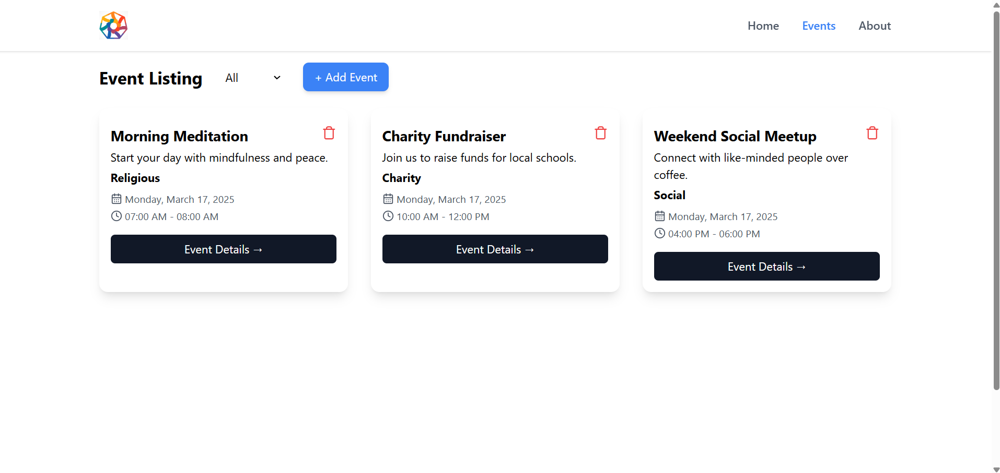

# Communion App

A responsive event listing and management web application built with **React.js** and **Tailwind CSS**. Users can explore, create, and manage events across different categories like **Religious**, **Social**, and **Charity**.

---

## Features

✅ Event listing with filtering by category  
✅ Persistent local storage for saving events  
✅ Animated form overlay for adding events  
✅ Smooth UI with Tailwind CSS  
✅ Fully responsive design

---

## Tech Stack

- **Frontend:** React.js, Tailwind CSS
- **State Management:** React Hooks (`useState`, `useEffect`)
- **Storage:** LocalStorage

---

## Screenshots

### **Home Page**

> Clean and simple home page  
> 

### **Add Event Form**

> Overlay form with category-based event listing  
> 

---

## Installation

### 1. Clone the Repository

```bash
git clone https://github.com/YourUsername/Communion-App.git
cd Communion-App
```

### 2. Install Dependencies

```bash
npm install
```

### 3. Start the server

```bash
npm run dev
```

## Usage

1. Explore Events – View events filtered by category
2. Add New Event – Use the "+ Add Event" button to create a new event
3. Delete Events – Remove events with a single click
4. Filter by Category – Quickly find events by type
